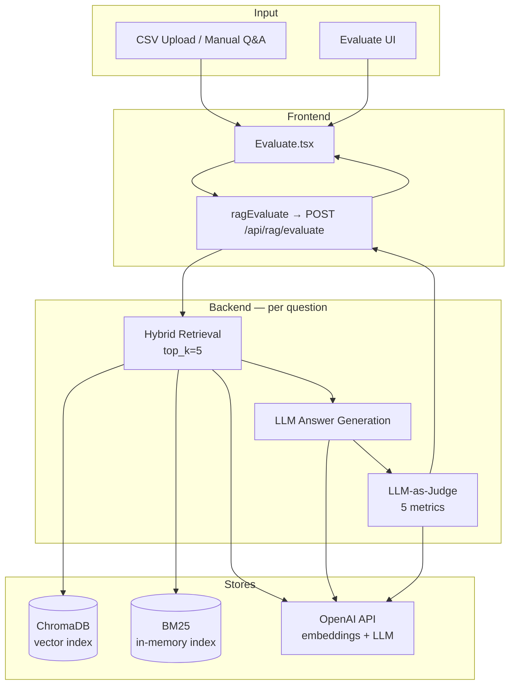
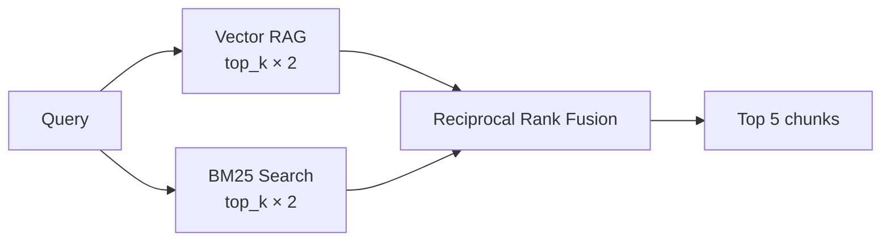

# SRAG Evaluation Loop

This document describes how the RAG evaluation pipeline works in SRAG: what runs where, which retrieval and generation techniques are used, how data flows from the UI through the backend, and how quality is scored.

---

## Overview

The evaluation loop measures **end-to-end RAG quality** by:

1. Taking a set of **ground-truth Q&A pairs** (`question` + `expected_answer`)
2. Running each question through the **same RAG pipeline** used in production (retrieve → generate)
3. Scoring the result with an **LLM-as-a-Judge** evaluator across five metrics
4. Returning **per-question detail** plus **aggregate averages** for the run

The primary entry point is the **Evaluate** page in the frontend (`frontend/src/pages/Evaluate.tsx`), backed by `POST /api/rag/evaluate`.

---

## High-Level Data Flow



---

## Prerequisites: Indexed Corpus

Evaluation only works against documents that have already been **uploaded and indexed**. Without indexed chunks, retrieval returns empty context and scores will be poor.

### Document ingestion pipeline

When a file is uploaded via `POST /api/documents/upload`, `DocumentService` routes it by file type:

| File type | Collection | Indexing strategy |
|-----------|------------|-------------------|
| `.txt`, `.json` | `text_documents` | Fixed-size word chunks → ChromaDB + BM25 |
| `.md` | `markdown_documents` | Structure-aware chunking (headings) |
| `.pdf` | `pdf_documents` | Hierarchical RAG (section/page-aware chunks) |
| `.csv` | `table_documents` | Table RAG (row/column aware) |

### Chunking defaults (`backend/app/core/config.py`)

| Setting | Default | Purpose |
|---------|---------|---------|
| `CHUNK_SIZE` | 512 words | Max chunk length |
| `CHUNK_OVERLAP` | 50 words | Overlap between consecutive chunks |
| `TOP_K` | 5 | Default retrieval count (eval hard-codes `top_k=5`) |

### Dual indexing

Every text chunk is stored in **two** retrieval backends:

1. **ChromaDB** — dense vector search using OpenAI embeddings (`text-embedding-3-small`)
2. **BM25** — sparse lexical search via `rank_bm25.BM25Okapi` (in-memory, rebuilt on index)

---

## Frontend Evaluation Flow

**File:** `frontend/src/pages/Evaluate.tsx`  
**API client:** `frontend/src/api/client.ts` → `ragEvaluate()`

### 1. Prepare dataset

Users can:

- Enter Q&A pairs manually in the UI
- Load sample questions (built-in)
- **Import CSV** with columns: `Question no`, `Eval Question`, `Eval Answer`
- Use pre-built datasets under `eval/` (e.g. `eval/manual_english.csv`)

### 2. Run evaluation

The UI validates that at least one pair has both `question` and `expected_answer` filled in.

**Important:** The frontend sends **one question at a time** to the backend (not the full batch in a single request). This enables a live progress bar (`done / total`) while each question completes.

```typescript
for (let i = 0; i < valid.length; i++) {
  const res = await ragEvaluate({
    questions: [valid[i]],
    dataset_name: `${datasetName}_q${i + 1}`,
  });
  // accumulate per_question results...
}
```

After all questions finish, the frontend computes its own aggregate averages from the collected `per_question` rows.

### 3. Display & export

- **Summary cards** — average of all five metrics + overall grade (Excellent / Good / Fair / Poor)
- **Per-question rows** — expandable detail with generated answer, retrieved context, scores, and rationales
- **CSV export** — full run including rationales and latency

### Grade thresholds (UI only)

| Average score | Label |
|---------------|-------|
| ≥ 0.80 | EXCELLENT |
| ≥ 0.60 | GOOD |
| ≥ 0.40 | FAIR |
| < 0.40 | POOR |

---

## Backend API

**Endpoint:** `POST /api/rag/evaluate`  
**File:** `backend/app/api/rag.py`

### Request

```json
{
  "questions": [
    {
      "question": "Who is eligible for the SCSS?",
      "expected_answer": "Senior citizens aged 60 and above."
    }
  ],
  "dataset_name": "my_eval_run"
}
```

### Response

```json
{
  "accuracy": 0.85,
  "faithfulness": 0.92,
  "context_precision": 0.70,
  "context_recall": 0.80,
  "answer_relevancy": 0.88,
  "latency_avg_ms": 4200.0,
  "failed_questions": [],
  "per_question": [
    {
      "question": "...",
      "expected_answer": "...",
      "generated_answer": "...",
      "retrieved_context": "chunk1\n---\nchunk2",
      "accuracy": 0.85,
      "faithfulness": 0.92,
      "answer_relevancy": 0.88,
      "context_precision": 0.70,
      "context_recall": 0.80,
      "accuracy_rationale": "...",
      "faithfulness_rationale": "...",
      "answer_relevancy_rationale": "...",
      "context_precision_rationale": "...",
      "context_recall_rationale": "...",
      "latency_ms": 4200.0
    }
  ],
  "dataset_name": "my_eval_run"
}
```

### Per-question processing loop

For each `{question, expected_answer}` pair:

```
┌─────────────────────────────────────────────────────────────┐
│ Step 1 — RETRIEVE                                           │
│   rag_service.retrieve(question, strategy="hybrid", top_k=5)│
│   → list of chunk dicts with chunk_text, filename, score    │
├─────────────────────────────────────────────────────────────┤
│ Step 2 — GENERATE                                           │
│   Build prompt: Context + [Source: filename] chunks + Q     │
│   OpenAI chat completion (gpt-4o-mini default)              │
│   System: concise, context-grounded assistant               │
├─────────────────────────────────────────────────────────────┤
│ Step 3 — SCORE (LLM-as-Judge)                               │
│   evaluate_single() → 5 metric calls to LLM                 │
│   Each returns { score: 0.0–1.0, rationale: "..." }         │
└─────────────────────────────────────────────────────────────┘
```

On failure, the API still returns a zeroed row with an `error` field and adds the question to `failed_questions`. Aggregates are computed only over successful rows.

---

## RAG Techniques Used During Eval

The eval endpoint **always uses hybrid retrieval** with `top_k=5`. It does not expose strategy selection in the UI.

### Available strategies in `RAGService` (for reference)

| Strategy | Implementation | Used in eval? |
|----------|----------------|---------------|
| `hybrid` | Vector + BM25 → RRF fusion | **Yes (default)** |
| `vector` | ChromaDB cosine similarity | No |
| `bm25` | BM25Okapi lexical search | No |
| `table` | Table RAG for CSV data | No |
| `pdf` | PDF hierarchical retrieval | No |
| `markdown` | Markdown structure-aware | No |

Eval searches the default collection **`text_documents`**. PDFs, markdown, and CSV files live in separate collections (`pdf_documents`, etc.), so eval results depend on which document types are indexed and whether those collections are queried. The current eval path only hits `text_documents` via hybrid RAG.

---

## Hybrid Retrieval (Step 1 Detail)

**File:** `backend/app/rag/hybrid_rag.py`



### Vector branch (`vector_rag.py`)

1. Embed query via OpenAI `/embeddings`
2. Search ChromaDB collection with cosine similarity
3. Attach `document_id`, `filename` from chunk metadata

### BM25 branch (`bm25.py`)

1. Tokenize query (lowercase word split)
2. Score all chunks in the in-memory BM25 index
3. Return top-scoring chunks with score > 0
4. Apply optional metadata filters in-memory

### Reciprocal Rank Fusion (`rrf.py`)

Fuses the two ranked lists:

```
RRF_score(chunk) = Σ  1 / (k + rank + 1)
```

- Default `k = 60`
- Chunks appearing in both lists get boosted
- Final output: top 5 fused chunks

Each result includes: `chunk_id`, `chunk_text`, `metadata`, `document_id`, `filename`, `score`.

---

## Answer Generation (Step 2 Detail)

**LLM:** OpenAI Chat Completions (`OPENAI_LLM_MODEL`, default `gpt-4o-mini`)  
**Client:** `backend/app/embeddings/openai_client.py`

### Prompt structure

```
Context:
[Source: document_a.pdf]
<chunk text>

[Source: document_b.txt]
<chunk text>

Question: <user question>
```

If no chunks were retrieved, the question is sent alone (no context block).

### System prompt (eval-specific)

```
You are a helpful assistant. Answer the question using the provided context.
Be concise and accurate.
```

This differs slightly from the general RAG system prompt in `rag_service.py` (which adds "If not in context, say 'Not found in available documents'").

---

## LLM-as-a-Judge Scoring (Step 3 Detail)

**File:** `backend/app/evaluation/evaluator.py`  
(Identical copy also exists at `backend/app/rag/evaluator.py` for agent use.)

Each metric is scored by a **separate LLM call** that must return JSON:

```json
{ "score": 0.85, "rationale": "One-sentence explanation." }
```

The judge system prompt enforces JSON-only output. On parse failure, a regex fallback extracts `"score"` from the raw response; otherwise the score defaults to `0.0`.

### Metrics

| Metric | What it measures | Inputs |
|--------|------------------|--------|
| **Accuracy** | Semantic match between generated and expected answer | `generated_answer`, `expected_answer` |
| **Faithfulness** | Answer grounded in retrieved context (no hallucination) | `generated_answer`, up to 5 context chunks |
| **Answer Relevancy** | Answer directly addresses the question | `question`, `generated_answer` |
| **Context Precision** | Fraction of retrieved chunks useful for the question | `question`, up to 8 context chunks |
| **Context Recall** | Retrieved context contains facts needed for expected answer | `expected_answer`, up to 8 context chunks |

All scores are clamped to `[0.0, 1.0]`.

### Latency note

`latency_ms` on each row measures **only the five judge LLM calls**, not retrieval or answer generation. End-to-end time per question is roughly:

```
retrieval + generation + (5 × judge calls)
```

With the frontend's sequential one-question-at-a-time loop, total run time scales linearly with dataset size.

---

## Eval Dataset Format

### Standard CSV (UI import)

```csv
Question no,Eval Question,Eval Answer
1,What is CIF?,Customer Information File is an 11-digit bank identifier.
2,Who is eligible for SCSS?,Senior citizens aged 60 and above.
```

- Header row is skipped
- Column 0 = question number (ignored)
- Column 1 = question
- Column 2+ = answer (rejoined if commas appear in the answer)

### Form-structured CSV converter

**File:** `eval/csv_convert.py`

Converts multi-row "form name + questions / blank + answers" spreadsheets into the flat eval format:

```bash
python eval/csv_convert.py input.csv output.csv
python eval/csv_convert.py input.csv output.csv --delimiter '\t'
```

Output columns: `Question no`, `Eval Question + form name`, `Eval Answer`

### Sample dataset

`eval/manual_english.csv` — 200+ Q&A pairs covering Indian banking forms (account opening, agriculture loans, MSME, PMMY, home loans, etc.).

---

## Agent-Based Evaluation (Separate Path)

SRAG also has an **agent evaluation** path that is **not** wired to the Evaluate UI but follows a similar scoring model.

**File:** `backend/app/agents/evaluator_agent.py`  
**Endpoint:** `POST /api/agents/evaluator`

The `RetrievalEvaluationAgent` scores an already-generated answer given chunks in context:

| Output field | Description |
|--------------|-------------|
| `faithfulness`, `answer_relevancy`, `context_precision`, `context_recall` | Same LLM-judge metrics |
| `retrieval_coverage` | Fraction of chunks with score > 0.5 |
| `retrieval_ok` | Heuristic: `faithfulness > 0.5 AND context_precision > 0.4` |
| `overall_score` | Weighted: 30% faithfulness + 30% relevancy + 20% precision + 20% recall |

The **Coordinator Agent** (`coordinator_agent.py`) orchestrates multiple retrieval agents (vector, sqlite, router, web) and can chain into the evaluator agent for multi-source runs. This is the agentic RAG path, distinct from the simple eval loop.

---

## Configuration

Environment variables (`.env` in `backend/`):

| Variable | Default | Role in eval |
|----------|---------|--------------|
| `OPENAI_API_KEY` | — | Required for embeddings, generation, and judging |
| `OPENAI_LLM_MODEL` | `gpt-4o-mini` | Answer generation + all judge calls |
| `OPENAI_EMBED_MODEL` | `text-embedding-3-small` | Query/chunk embeddings for vector search |
| `OPENAI_TIMEOUT` | `120` | HTTP timeout (frontend axios also uses 120s) |
| `CHROMA_PERSIST_DIR` | `./chroma_db` | Vector store location |
| `CHUNK_SIZE` / `CHUNK_OVERLAP` | `512` / `50` | Affects retrieval quality |

---

## Persistence & Logging

| What | Where |
|------|-------|
| Vector embeddings | `backend/chroma_db/` |
| Document metadata & chunks | SQLite `rag_platform.db` |
| Evaluation run summaries | `evaluation_runs` table (via `rag_service.evaluate()` — **not** called by `/api/rag/evaluate`) |
| Retrieval logs | `retrieval_logs` table + `backend/logs/rag.log` |

**Note:** The `/api/rag/evaluate` endpoint in `api/rag.py` does **not** persist results to `evaluation_runs`. The older `RAGService.evaluate()` method in `rag_service.py` does write aggregate metrics to the database but is a separate code path without per-question rationales.

---

## Error Handling

| Failure | Behavior |
|---------|----------|
| Empty retrieval | Generation runs without context; context metrics likely score 0 |
| OpenAI API error | Question marked failed; zero scores + `error` in `per_question` |
| Judge JSON parse error | Regex score extraction attempt; fallback score `0.0` |
| BM25 index missing | Hybrid RAG falls back to vector-only (BM25 branch returns `[]`) |
| Vector search failure | Hybrid RAG falls back to BM25-only |

---

## End-to-End Sequence (Single Question)

```
User clicks "Run Evaluation"
        │
        ▼
Evaluate.tsx ──POST──► /api/rag/evaluate { questions: [1 pair] }
        │
        ▼
hybrid_rag.retrieve()
  ├─ vector_rag: embed query → ChromaDB search (top 10)
  ├─ bm25: lexical search (top 10)
  └─ RRF fuse → top 5 chunks
        │
        ▼
OpenAI chat: context + question → generated_answer
        │
        ▼
evaluate_single()
  ├─ compute_accuracy()
  ├─ compute_faithfulness()
  ├─ compute_answer_relevancy()
  ├─ compute_context_precision()
  └─ compute_context_recall()
        │
        ▼
Response → UI updates progress → repeat for next question
        │
        ▼
Frontend aggregates averages → display summary + export CSV
```

---

## Interpreting Results

Use metrics together, not in isolation:

| Pattern | Likely diagnosis |
|---------|------------------|
| Low **context recall**, low **accuracy** | Retrieval missed the right chunks — check indexing, chunk size, or collection |
| High **faithfulness**, low **accuracy** | Model faithfully summarized irrelevant context |
| Low **context precision** | Too much noise in top-k — tune hybrid weights or reduce top_k |
| High **answer relevancy**, low **faithfulness** | Model answered on-topic but hallucinated beyond context |
| Low **accuracy**, high **context recall** | Right info retrieved but generation failed to use it |

---

## Key Source Files

| Component | Path |
|-----------|------|
| Eval API endpoint | `backend/app/api/rag.py` |
| LLM-as-Judge metrics | `backend/app/evaluation/evaluator.py` |
| RAG service (retrieve/query) | `backend/app/services/rag_service.py` |
| Hybrid retrieval | `backend/app/rag/hybrid_rag.py` |
| Vector retrieval | `backend/app/rag/vector_rag.py` |
| BM25 retrieval | `backend/app/rag/bm25.py` |
| RRF fusion | `backend/app/rag/rrf.py` |
| Document indexing | `backend/app/services/document_service.py` |
| Evaluate UI | `frontend/src/pages/Evaluate.tsx` |
| API client | `frontend/src/api/client.ts` |
| Eval datasets & CSV tools | `eval/` |
| Agent evaluator | `backend/app/agents/evaluator_agent.py` |

---

## Running an Eval (Quick Start)

1. Start backend: `uvicorn app.main:app --reload --port 8000` (from `backend/`)
2. Start frontend: `npm start` (from `frontend/`)
3. Upload and index documents via the Documents page
4. Open **Evaluate**, import `eval/manual_english.csv` or add Q&A pairs
5. Click **Run Evaluation**
6. Review per-question scores and export CSV for offline analysis

Ensure `OPENAI_API_KEY` is set — each question triggers **6+ LLM calls** (1 generation + 5 judge metrics) plus **1 embedding call** for retrieval.
